# 在线考试系统（移动端）

<p align="center">
  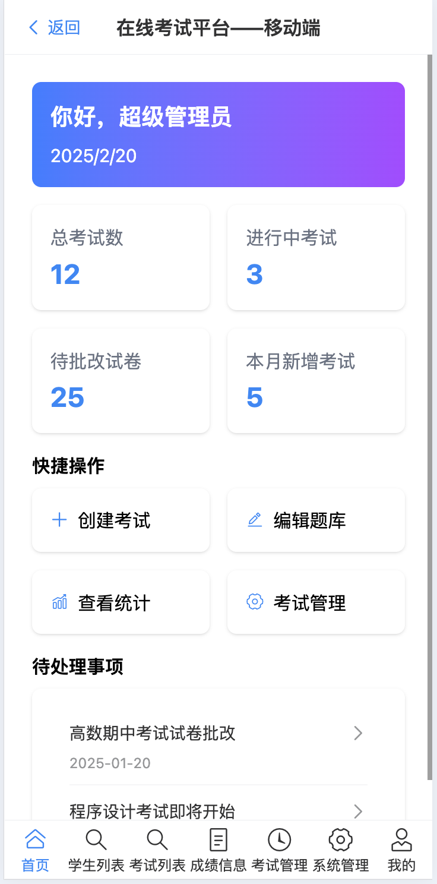
</p>

## 📖 项目介绍

在线考试系统是一个基于前后端分离架构的现代化在线考试平台。系统采用 Vue 3 + TypeScript + Tailwind CSS 作为前端技术栈，SpringBoot + MyBatis-Plus 作为后端技术栈，旨在提供一个功能完善、用户体验优秀的在线考试解决方案。

### ✨ 主要特性

- 🔐 多角色权限管理（管理员、教师、学生）
- 📝 智能题库管理（选择题、判断题、填空题）
- 📋 灵活的在线组卷功能
- ⏱️ 考试过程智能监控
- 📊 成绩自动评判与统计分析
- 💻 响应式设计，支持多端适配
- 🛡️ TypeScript 全面类型支持
- 🎨 现代化 UI 设计，优秀的用户体验

## 🛠️ 技术栈

### 前端技术

- Vue 3 - 渐进式 JavaScript 框架
- TypeScript - JavaScript 的超集
- Tailwind CSS - 原子化 CSS 框架
- Vue Router - 路由管理
- Pinia - 状态管理
- Axios - HTTP 客户端
- ECharts - 数据可视化
- Vant - 移动端组件库

### 后端技术

- SpringBoot 2.1.2 - 后端核心框架
- MyBatis-Plus 3.1.0 - ORM 框架
- MySQL - 数据库
- Druid - 数据库连接池
- Maven - 项目管理工具
- Java 8 - 开发语言

## 🔍 功能模块

### 👨‍💼 管理员模块

- 系统管理
- 用户管理（教师、学生）
- 权限控制
- 系统监控

### 👨‍🏫 教师模块

- 题库管理
- 试卷管理
- 考试安排
- 成绩统计
- 学生管理

### 👨‍🎓 学生模块

- 在线考试
- 成绩查询
- 练习测试
- 个人信息管理

## 🚀 快速开始

### 环境要求

- Node.js 16+
- Java 8+
- MySQL 5.7+
- Maven 3.6+

### 开发环境设置

1. 克隆项目

```bash
git clone https://github.com/Zhengke0110/exam
cd M
```

2. 前端项目启动

```bash
cd fronted
npm install
npm run dev
```

3. 后端项目启动

```bash
cd backed
mvn clean install
mvn spring-boot:run
```

### 生产环境部署

1. 前端构建

```bash
cd fronted
npm run build
```

2. 后端打包

```bash
cd backed
mvn clean package
```

3. 部署配置

```bash
# Nginx 配置示例
server {
    listen 80;
    server_name your-domain.com;

    location / {
        root /path/to/frontend/dist;
        try_files $uri $uri/ /index.html;
    }

    location /api {
        proxy_pass http://localhost:8080;
    }
}
```

## 📸 系统截图

### 🏠 系统首页

<table>
  <tr>
    <td></td>
    <td>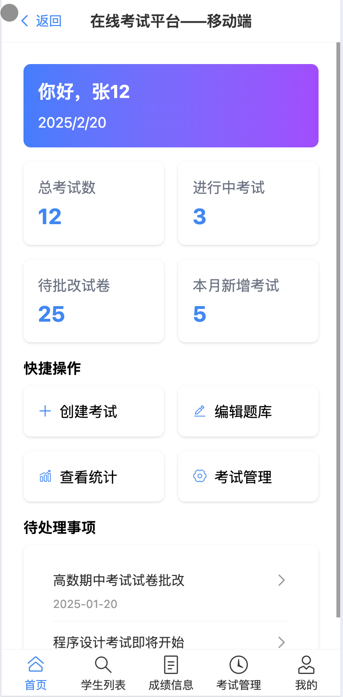</td>
  </tr>
  <tr>
    <td></td>
    <td>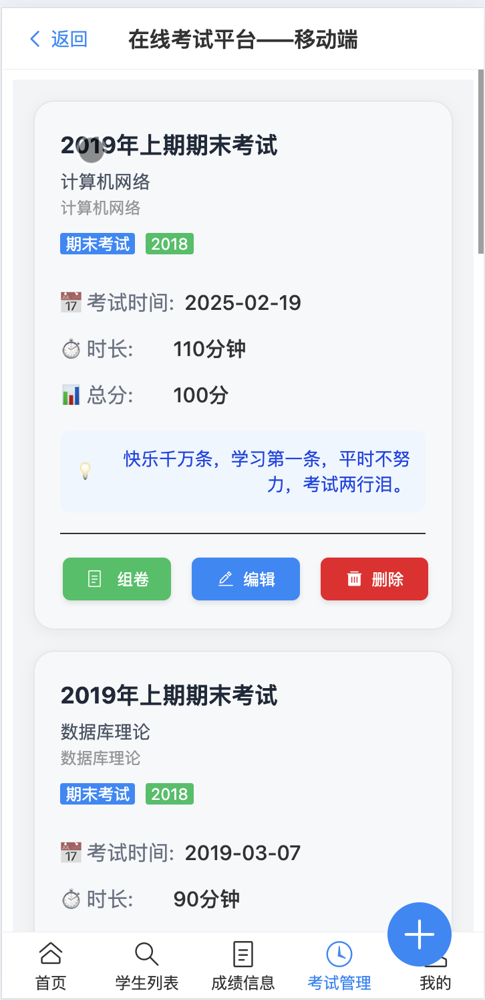</td>
  </tr>
</table>

### 👨‍💼 管理员功能

<table>
  <tr>
    <td>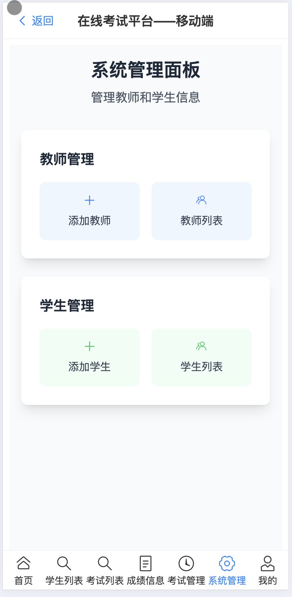</td>
    <td></td>
  </tr>
  <tr>
    <td></td>
    <td>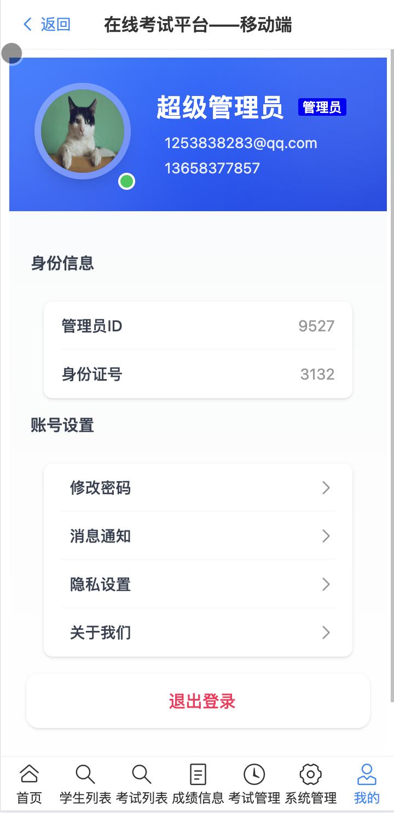</td>
  </tr>
</table>

### 👨‍🏫 教师功能

<table>
  <tr>
    <td>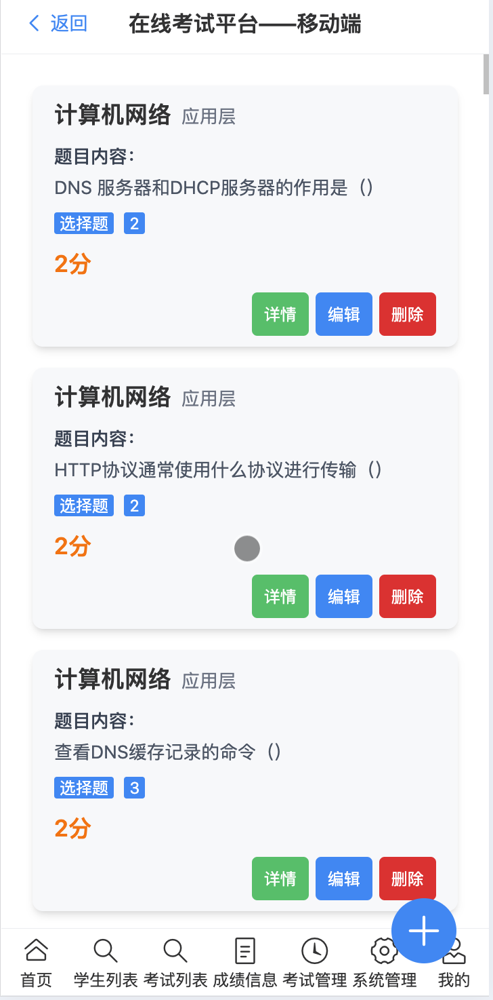</td>
    <td>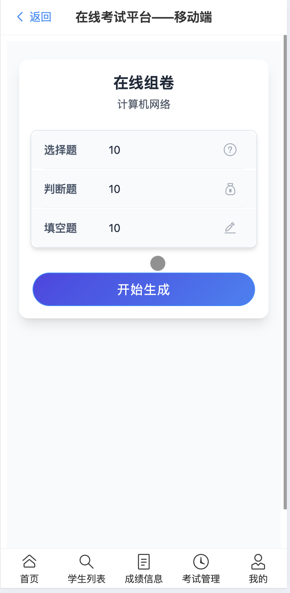</td>
  </tr>
  <tr>
    <td>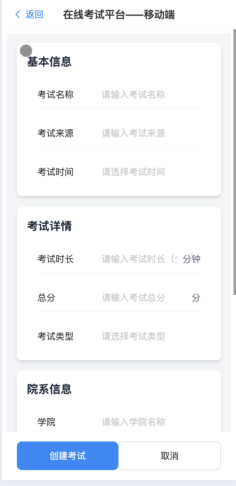</td>
    <td></td>
  </tr>
  <tr>
    <td></td>
    <td>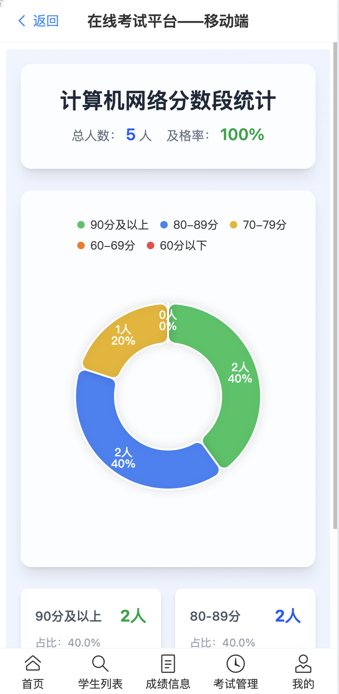</td>
  </tr>
  <tr>
    <td>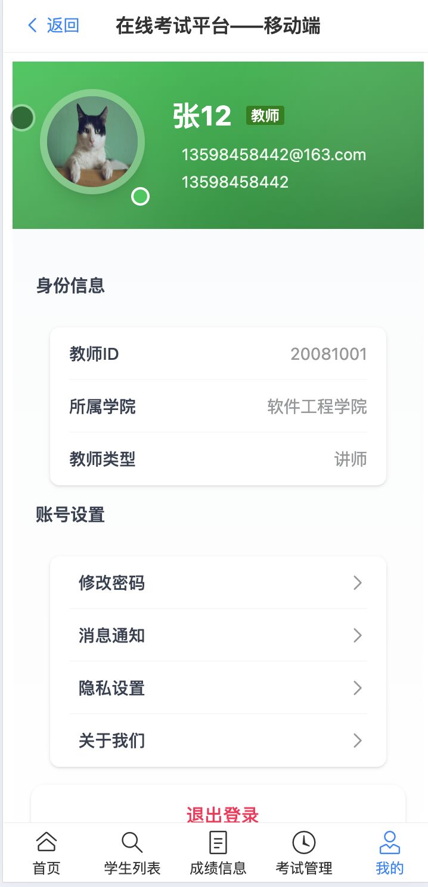</td>
    <td>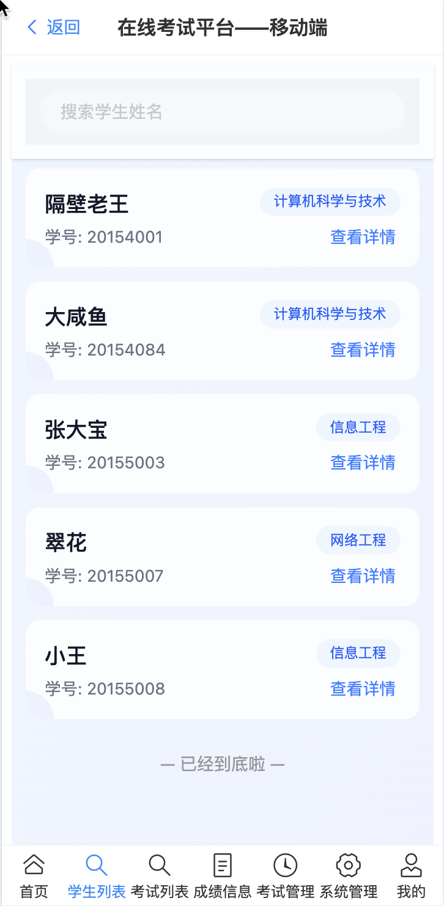</td>
  </tr>
</table>

### 👨‍🎓 学生功能

<table>
  <tr>
    <td>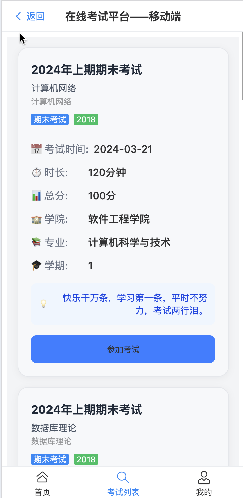</td>
    <td>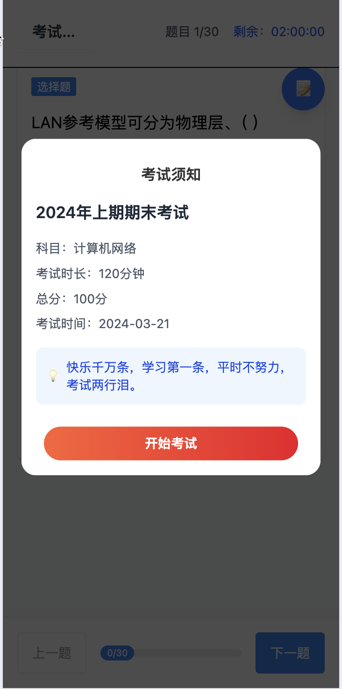</td>
  </tr>
  <tr>
    <td>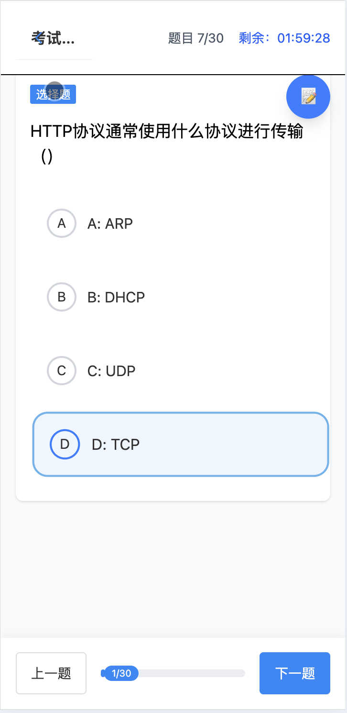</td>
    <td>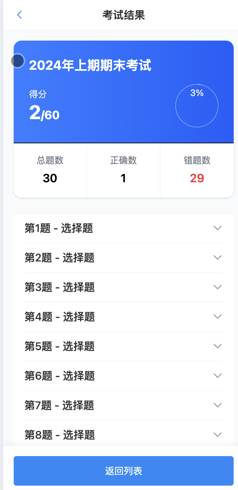</td>
  </tr>
  <tr>
    <td>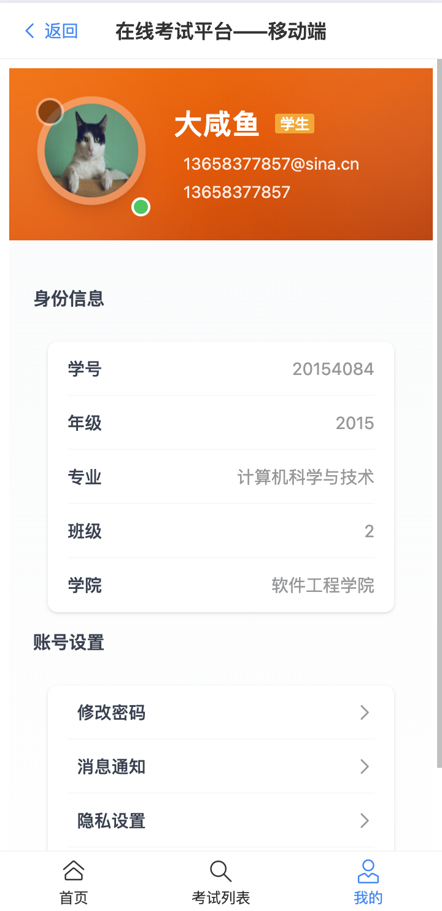</td>
  </tr>
</table>

## 📄 开源协议

本项目采用 [MIT](LICENSE) 协议开源。

## 👥 贡献指南

欢迎提交 Issue 或 Pull Request 来帮助改进项目。在提交之前，请：

1. Fork 本仓库
2. 创建特性分支 (`git checkout -b feature/AmazingFeature`)
3. 提交改动 (`git commit -m 'Add some AmazingFeature'`)
4. 推送到分支 (`git push origin feature/AmazingFeature`)
5. 开启一个 Pull Request

## 🙏 致谢

感谢所有为这个项目做出贡献的开发者们！
