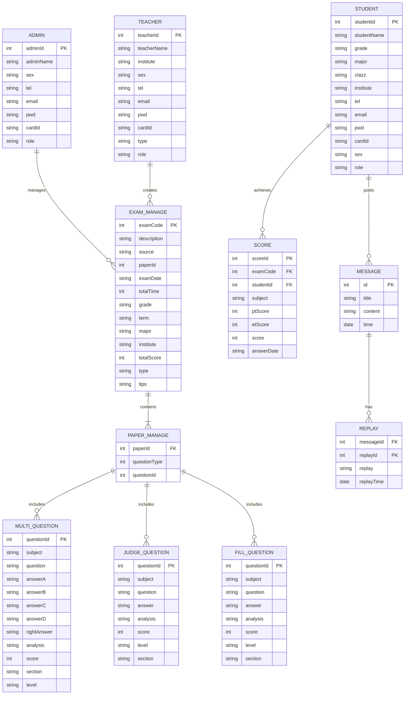
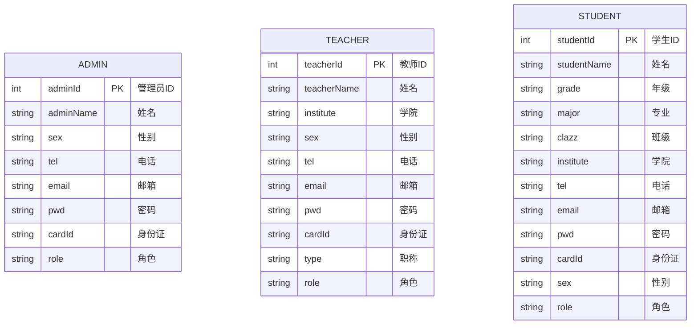
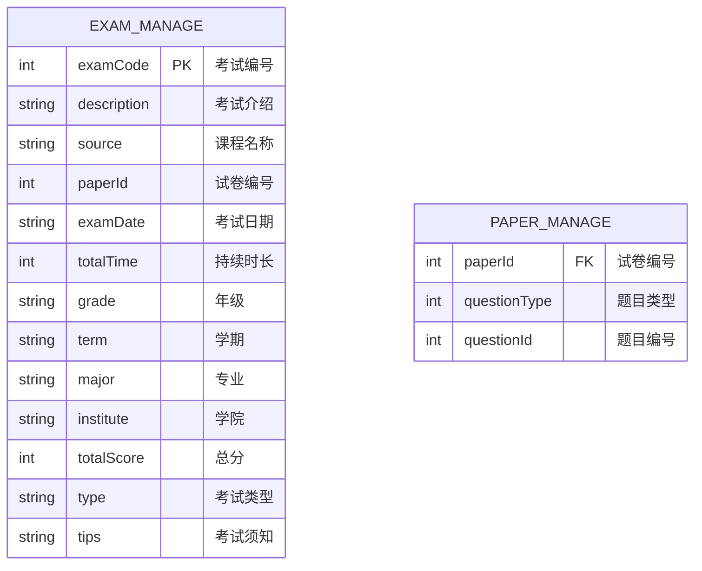
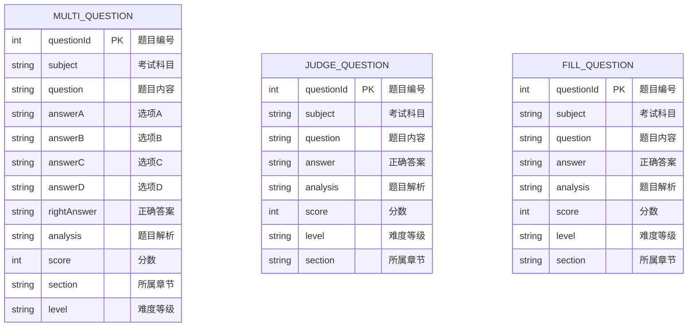
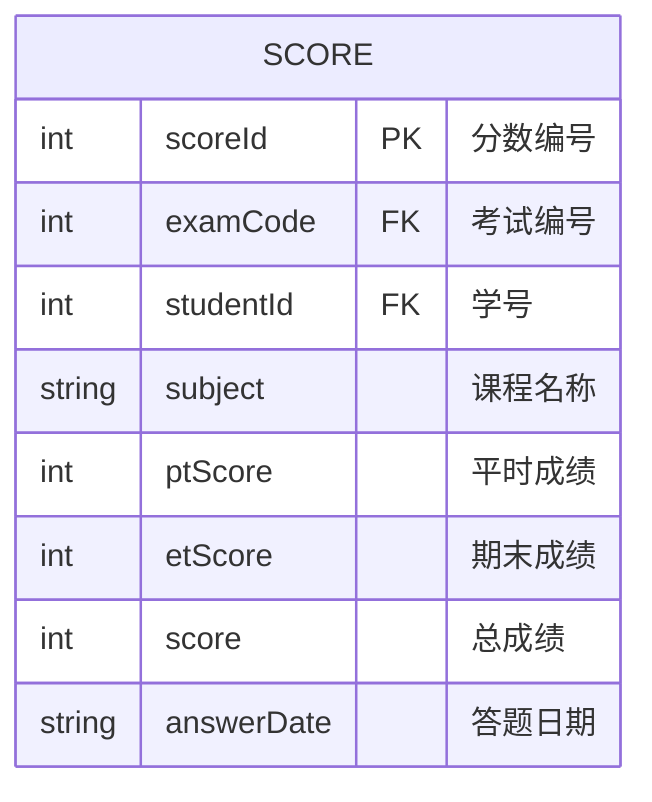
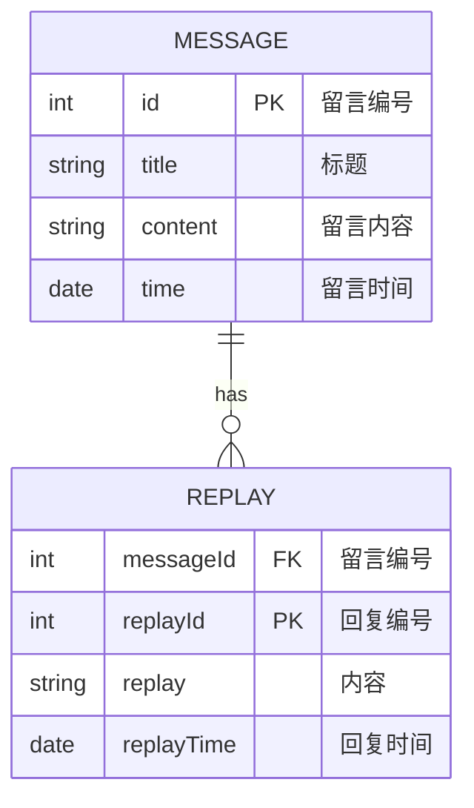

# 在线考试系统数据库设计文档

## 1. 整体 ER 图

## 2. 数据表结构

### 2.1 管理员表(admin)

| 字段名    | 类型    | 长度 | 允许空 | 主键 | 说明                           |
| --------- | ------- | ---- | ------ | ---- | ------------------------------ |
| adminId   | int     | 9    | 否     | 是   | ID 号                          |
| adminName | varchar | 20   | 是     | 否   | 姓名                           |
| sex       | varchar | 2    | 是     | 否   | 性别                           |
| tel       | varchar | 11   | 是     | 否   | 电话号码                       |
| email     | varchar | 20   | 是     | 否   | 电子邮箱                       |
| pwd       | varchar | 16   | 是     | 否   | 密码                           |
| cardId    | varchar | 18   | 是     | 否   | 身份证号                       |
| role      | varchar | 1    | 是     | 否   | 角色(0 管理员，1 教师，2 学生) |

### 2.2 教师表(teacher)

| 字段名      | 类型    | 长度 | 允许空 | 主键 | 说明     |
| ----------- | ------- | ---- | ------ | ---- | -------- |
| teacherId   | int     | 9    | 否     | 是   | ID       |
| teacherName | varchar | 20   | 是     | 否   | 姓名     |
| institute   | varchar | 20   | 是     | 否   | 学院     |
| sex         | varchar | 2    | 是     | 否   | 性别     |
| tel         | varchar | 11   | 是     | 否   | 电话号码 |
| email       | varchar | 20   | 是     | 否   | 邮箱     |
| pwd         | varchar | 16   | 是     | 否   | 密码     |
| cardId      | varchar | 18   | 是     | 否   | 身份证号 |
| type        | varchar | 20   | 是     | 否   | 职称     |
| role        | varchar | 1    | 是     | 否   | 角色     |

### 2.3 学生表(student)

| 字段名      | 类型    | 长度 | 允许空 | 主键 | 说明     |
| ----------- | ------- | ---- | ------ | ---- | -------- |
| studentId   | int     | 9    | 否     | 是   | ID       |
| studentName | varchar | 20   | 是     | 否   | 姓名     |
| grade       | varchar | 4    | 是     | 否   | 年级     |
| major       | varchar | 20   | 是     | 否   | 专业     |
| clazz       | varchar | 10   | 是     | 否   | 班级     |
| institute   | varchar | 30   | 是     | 否   | 学院     |
| tel         | varchar | 11   | 是     | 否   | 电话号码 |
| email       | varchar | 30   | 是     | 否   | 电子邮件 |
| pwd         | varchar | 16   | 是     | 否   | 密码     |
| cardId      | varchar | 18   | 是     | 否   | 身份证号 |
| sex         | varchar | 2    | 是     | 否   | 性别     |
| role        | varchar | 1    | 是     | 否   | 角色     |

## 3. 单独 ER 图

### 3.1 用户管理模块

### 3.2 考试管理模块

### 3.3 题库管理模块

### 3.4 成绩管理模块

### 3.5 交互管理模块

