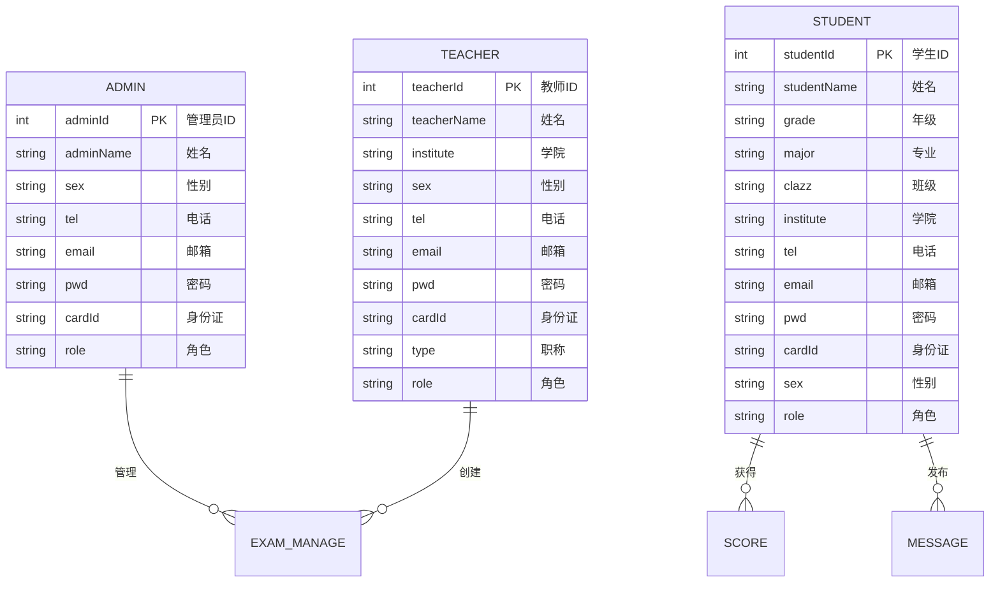
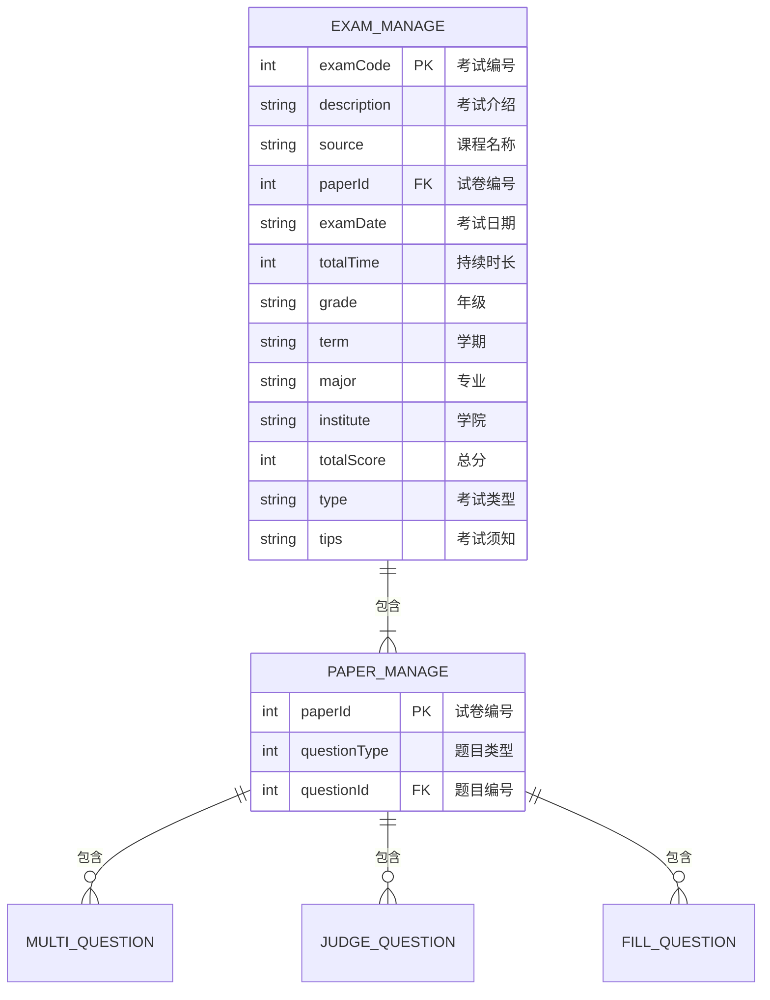
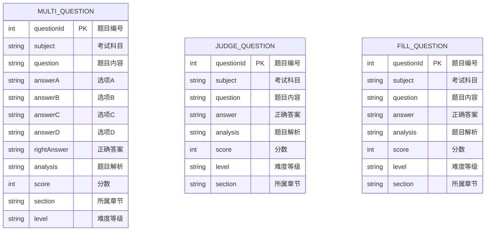
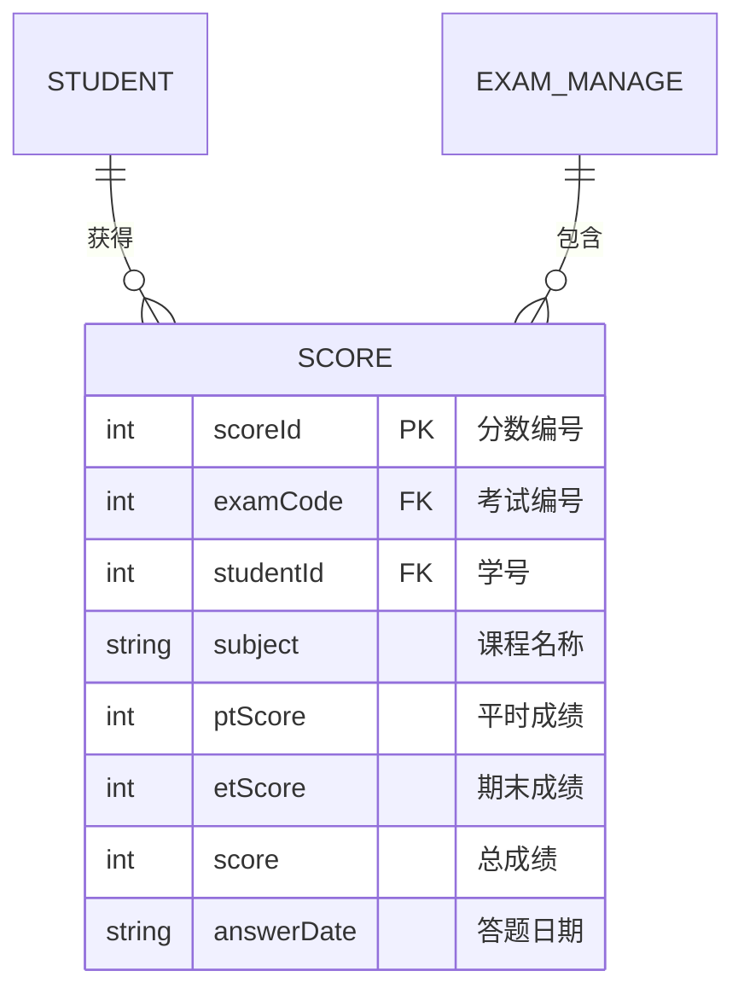
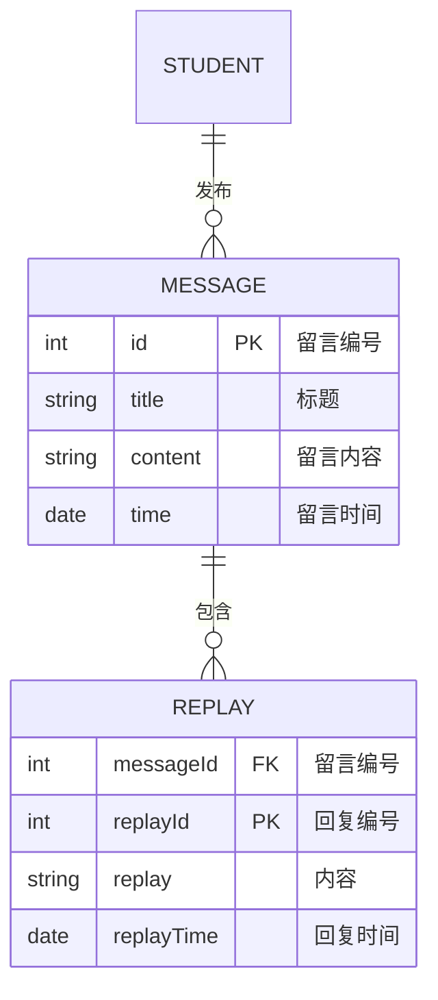

# 在线考试系统 ER 图设计（Mermaid 版）

## 1. 用户管理模块

### 1.1 用户关系图

## 2. 考试管理模块

### 2.1 考试与试卷关系

## 3. 题库管理模块

### 3.1 试题关系图

## 4. 成绩管理模块

### 4.1 成绩关系图

## 5. 交互管理模块

### 5.1 留言回复关系图

## 关系说明

1. 一对多关系(||--o{)：

   - 管理员对考试管理
   - 教师对考试管理
   - 学生对成绩
   - 考试管理对试卷
   - 试卷对题目
   - 学生对留言
   - 留言对回复

2. 实体属性说明：

   - PK: 主键(Primary Key)
   - FK: 外键(Foreign Key)

3. 关系类型：
   - ||--o{ : 一对多
   - ||--|{ : 一对多(必需)
   - }o--o{ : 多对多
   - |o--o| : 一对一
