# 在线考试系统标准 ER 图设计

## 1. 用户管理模块

### 1.1 管理员实体 ER 图

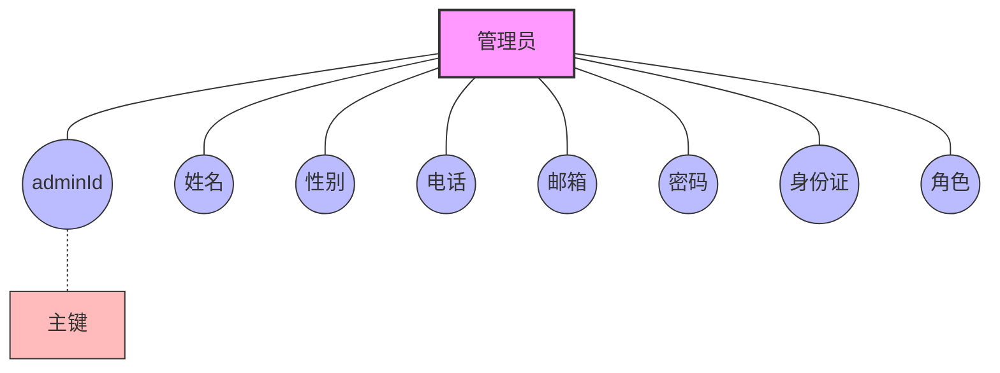

### 1.2 教师实体 ER 图

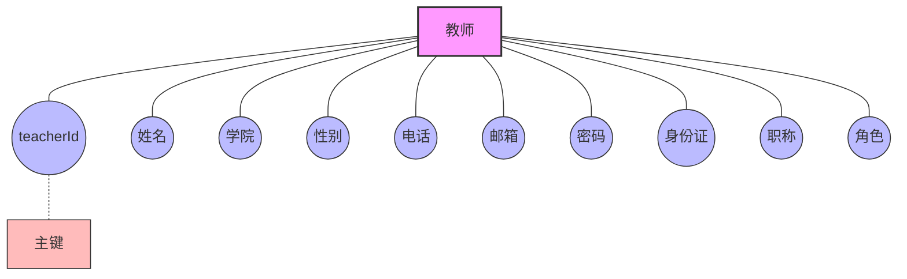

## 2. 考试管理模块

### 2.1 考试管理 ER 图

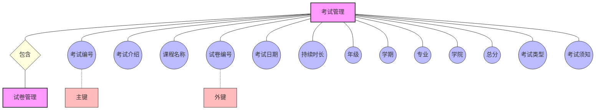

### 2.2 试题关系 ER 图

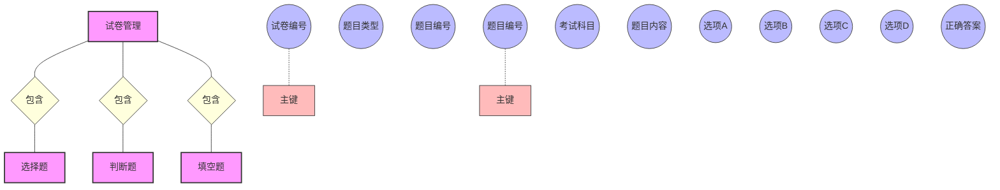

## 3. 题库管理模块

### 3.1 选择题表(multi_question)ER 图

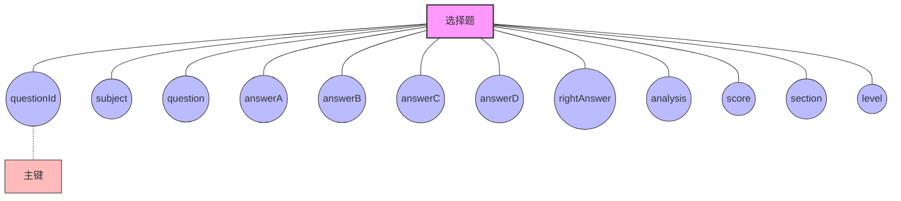

### 3.2 判断题表(judge_question)ER 图

### 3.3 填空题表(fill_question)ER 图

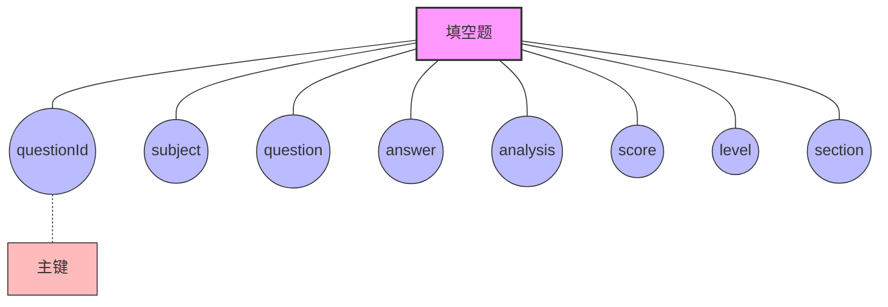

### 3.4 试卷管理表(paper_manage)ER 图

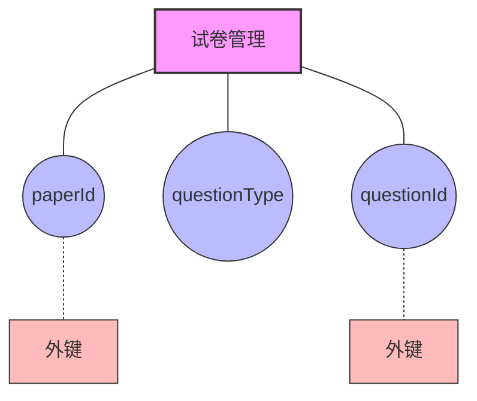

### 3.5 成绩表(score)ER 图

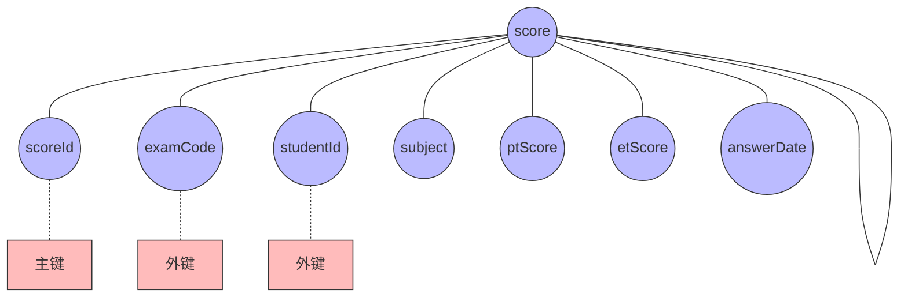

### 3.6 留言表(message)ER 图

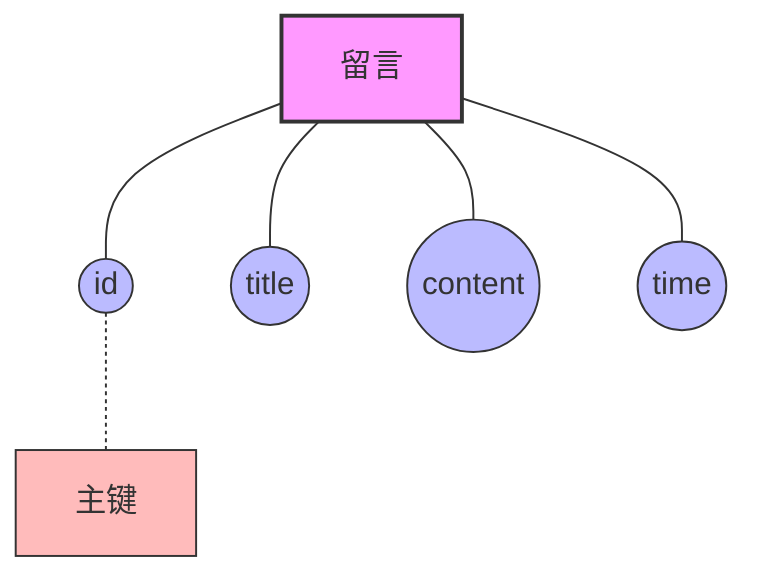

### 3.7 回复表(replay)ER 图

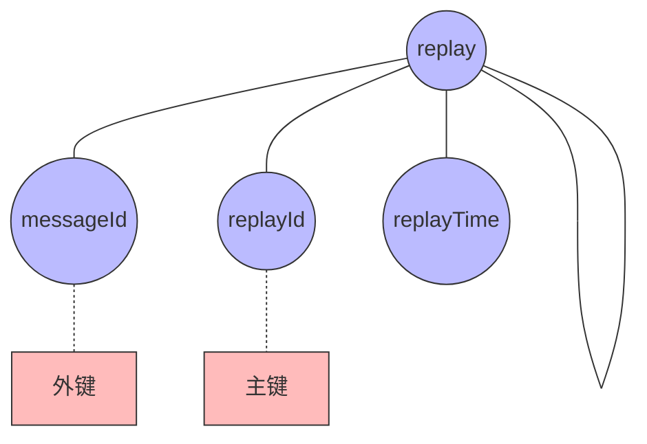

## 图例说明

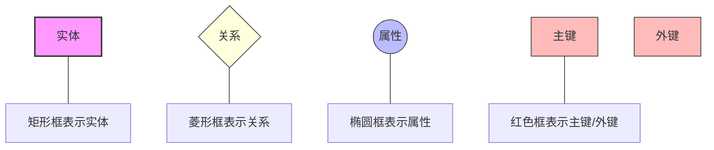
